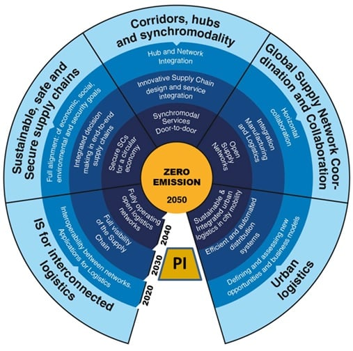
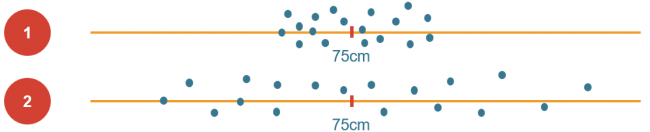
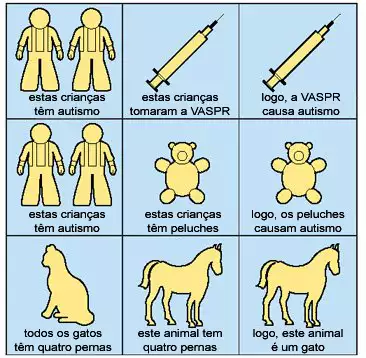
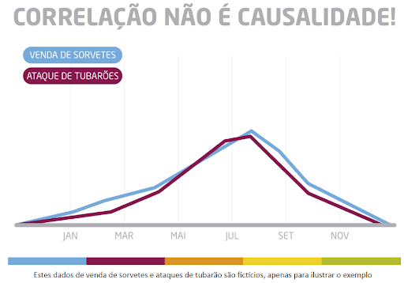
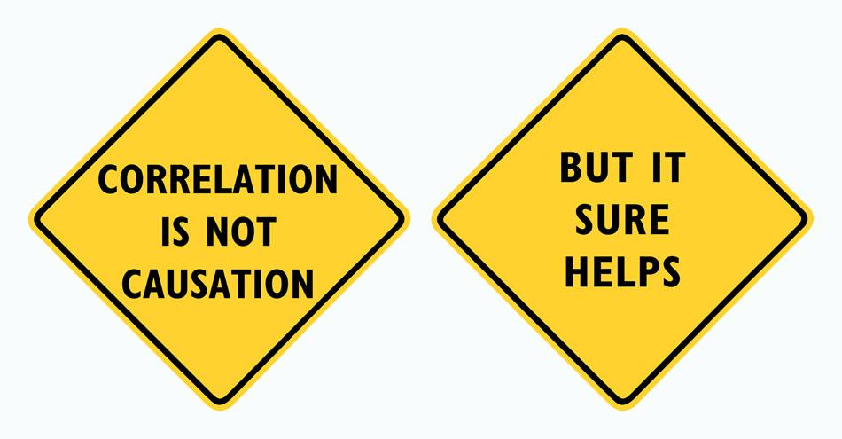

```{r setup, include=FALSE}
options(htmltools.dir.version = FALSE)

```

```{r xaringan-themer, include=FALSE, warning=FALSE}
library(xaringanthemer)
style_duo_accent(
  primary_color = "#1381B0",
  secondary_color = "#FF961C",
  inverse_header_color = "#FFFFFF"
)
library(knitr)
setwd("D:/OneDrive - cefetmg.br/01_disciplinas/ERE/gestao_qualidade_ere/qua_sinc_7")

```

class: center, middle

# Curso para revisão! 

https://ead.sestsenat.org.br/cursos/qualidade-nos-produtos-e-servicos/

---

## Evolução das funções organizacionais

#### Venda + produção 
#### Logística como função estratégica - Gestão da cadeia de suprimentos
#### Just-in-time

--

.pull-left[
```{r echo=FALSE, fig.align="left", message=FALSE, warning=FALSE, out.width="100%"}

```
]

--

.pull-right[
```{r echo=FALSE, fig.align="right", message=FALSE, warning=FALSE, out.width="100%"}
knitr::include_graphics("./img/amazon.jpg")
```
]

---

## Cadeia de suprimentos 

```{r echo=FALSE, fig.align="center", message=FALSE, warning=FALSE, out.width="100%"}
knitr::include_graphics("./img/supply-chain.jpg")
```

---
## Cadeia de suprimentos digital 

### Omnichannel

```{r echo=FALSE, fig.align="center", message=FALSE, warning=FALSE, out.width="200%"}

```


---

## Internet física
  
  - a eficiência de transportes na Europa ronda os 44%.    
  - sistema logístico global e aberto que espelha as metodologias e caraterísticas do funcionamento da internet. Ou seja, utiliza-se uma rede global conectada, com protocolos colaborativos, com o intuito de facilitar a partilha de bens.


```{r echo=FALSE, fig.align="center", message=FALSE, warning=FALSE, out.width="50%"}

```

---

## Análise de varibilidade dos processos

- Medidas de tendência central
- Medidas de dispersão

```{r echo=FALSE, message=FALSE, fig.align="center", warning=FALSE, out.width="80%"}

```

---
## Causalidade x correlação

- Explicação
- Controle

.pull-left[
```{r echo=FALSE, message=FALSE, fig.align="center", warning=FALSE, out.width="80%"}

```
]

.pull-right[
```{r echo=FALSE, message=FALSE, fig.align="center", warning=FALSE, out.width="80%"}

```
]

---

```{r echo=FALSE, message=FALSE, fig.align="center", warning=FALSE, out.width="80%"}
knitr::include_graphics("./img/aulas-estatistica.png")
```

```{r echo=FALSE, message=FALSE, fig.align="center", warning=FALSE, out.width="80%"}

```

---

## Ferramentas para Gestão da Qualidade

- Folha de verificação   
- Estratificação   
- Gráfico de Pareto   
- Diagrama de causa e efeito   
- Histograma   
- Fluxograma   
- Diagrama de dispersão   
- Gráficos de controle   
- O ciclo PDCA   
- Brainstorming   
- 5S   
- 5W   
- 5W2H   


---
class: inverse, middle, center

# Sem atividade preliminar na semana 7

---

## Primeira atividade sobre o estudo de caso

#### Prazo para entrega desta atividade: 17/10/2020

1. Descreva o processo de entregas por meio de um **fluxograma**.
2. Explore as **características** das entregas em relação ao tempo, local de entrega e tipo de problema considerando as ocorrências e o custo envolvido nessas ocorrências.
3. Quais são os **problemas** mais relevantes para a empresa Rapidão Transportes? Explique como você **quantificou** o problema (métrica e unidade considerados)? Por que fez essa escolha?
4. O que serão os próximos passos para melhoria do processo?

---

class: inverse, middle, center

# Dúvidas?


